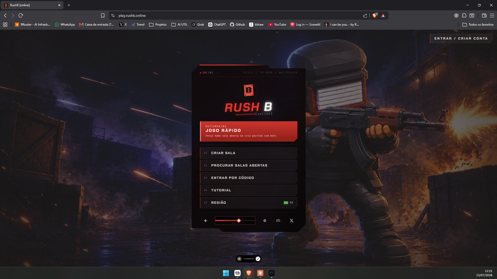

# Referências visuais do Wayfinder

## Launcher principal

Usar `rush-b-launcher-structure-reference.png` como referência de **estrutura e hierarquia** para a landing/launcher do Bomba PvP:

- cena visual em tela cheia como plano de fundo;
- painel de entrada focal e centralizado;
- ação principal destacada;
- opções secundárias empilhadas e fáceis de comparar;
- conta separada no canto superior;
- utilidades compactas na base do painel.

Não copiar marca, logotipo, arte, textos ou opções específicas do jogo de referência. Salas privadas, busca de salas e entrada por código não fazem parte do escopo atual do Bomba PvP.
